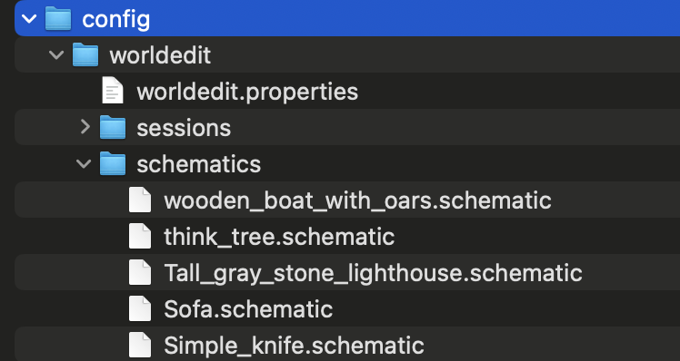

# Minecraft-structure-generation

## Requirements

- **Java**: Ensure you have Java Development Kit (JDK) minimum version 17 installed.

- **Gradle**: To build the mod.

- **Minecraft Forge**: Download and install the appropriate version of Minecraft Forge for your Minecraft version.

- **World Edit Module**: Install the World Edit mod to easily manipulate the Minecraft world.

- **Python Libraries**: Install all required python libraries
Note: python should be <=3.12

```bash
pip install -r requirements.txt
```


## Setup

1) Compile minecraft mod in `./mod` directory using

```bash
gradle build
```

2) In directory `./mod/build/libs` will be generated `.jar` which you need to add to forge folder


3) Make sure that `mods` directory has World Edit mod, also add mode built in step 1


4) Duplicate structures directory from the project, to forge directory `schematics`



## Run python server

```bash
python3.12 server.py
```

## Usage